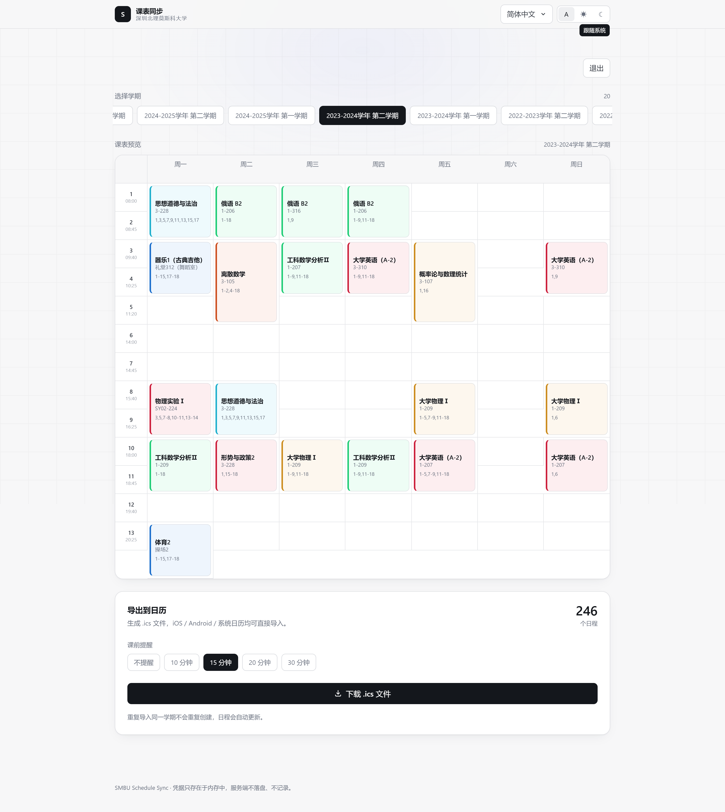
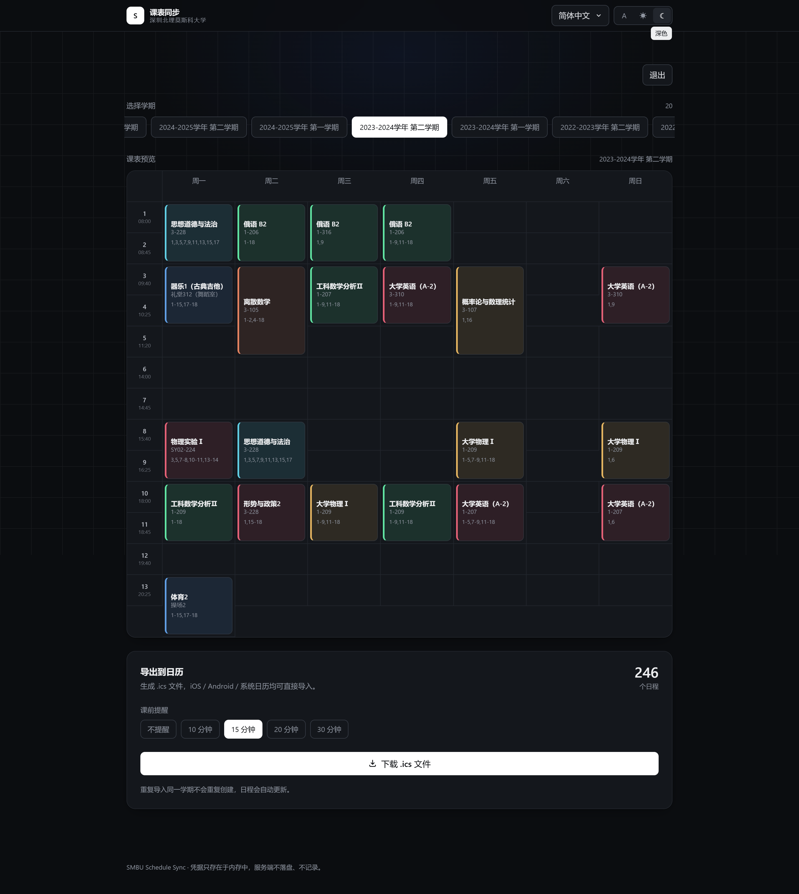

<div align="center">

# 📅 SMBU Schedule Sync

**把深北莫教务系统的课表，一键变成手机日历。**

输入 CAS 账号密码 → 自动抓取任意学期课表 → 生成 `.ics` 一键导入 iOS / Android / 电脑日历。

[简体中文](README.md) · [English](README.en.md) · [Русский](README.ru.md)

</div>

---

## ✨ 效果

| 亮色 | 深色 |
|---|---|
|  |  |

<sub>示例：2023–2024 学年第二学期（21 个课块，真实账号抓取，姓名学号已隐去）</sub>

选择学期 → 预览整学期课表 → 选课前提醒 → 下载 `.ics` 导入日历。支持入学以来的**全部学期**，重复导入同一学期会自动去重更新。

## 🚀 特性

- **真·一键**：CAS 登录 + 强智教务抓取全在服务端完成，手机上无需任何配置
- **全学期回溯**：大一至今每个学期的课表都能抓
- **三语界面**：简体中文 / English / Русский
- **深色模式**：自动跟随系统 + 手动切换
- **RFC 5545 标准 `.ics`**：Asia/Shanghai 时区、课前提醒（不提醒/10/15/20/30 分钟）、周次+节次精确映射
- **不碰你的密码**：凭证仅存于内存会话，服务端不落盘、不记录、不回传，注销即焚

## 🏗️ 工作原理

```
浏览器 ──HTTPS──▶ FastAPI ──httpx──▶ authserver.smbu.edu.cn (CAS)
                            └─httpx──▶ jw.smbu.edu.cn/jwapp  (强智 REST)
```

1. 前端把账密发到 `/api/auth/login`（密码仅在登录那次请求的内存中使用，随即丢弃）
2. 后端完成 CAS 登录（用户名 + AES-CBC 加密密码），拿到 jwapp 会话 Cookie
3. 拉取学期列表、周次日期、节次时间表、课表，归一化为标准模型
4. 生成 `.ics`：每周每节一节课 = 一个 VEVENT，带时区与课前提醒

> 校外网络自动走 WebVPN 隧道（深澜 Srun + headless 浏览器握手），细节见 [WEBVPN.md](WEBVPN.md)。

## 📦 快速开始（Docker 自托管）

```bash
docker build -f deploy/Dockerfile -t smbu-calendar:latest .
docker run -d --name smbu-app -p 8771:8770 --restart unless-stopped \
  smbu-calendar:latest
# 打开 http://localhost:8771
```

完整部署（TLS / nginx 边缘限流 / WebVPN 接入模式 / 离线 mock 压测）见 [deploy/README.md](deploy/README.md)。

### 本地开发

```bash
# 后端
cd backend && pip install -r requirements.txt
uvicorn app.main:app --host 127.0.0.1 --port 8770

# 前端
cd frontend && npm install && npm run dev   # http://localhost:5173
```

环境变量（`SMBU_` 前缀）见 [backend/app/config.py](backend/app/config.py)。

## 🔒 安全与隐私

- 密码只在登录请求的内存中出现一次，用完即弃；服务端无数据库，会话在内存中过期自动淘汰
- 全局上游并发闸门 + 按 IP/学号滑动窗口限流，突发流量优雅返回 429，不打穿教务系统
- Locust 压测报告见 [docs/STRESS_REPORT.md](docs/STRESS_REPORT.md)

## ⚠️ 免责声明

本项目与深圳北理莫斯科大学官方无关，仅供个人课表管理使用。请勿滥用抓取功能；使用本工具产生的一切后果由使用者自行承担。

## 📄 License

[MIT](LICENSE) © 2026 左典典 (D Zuo / [swiftiejerry](https://github.com/swiftiejerry))
